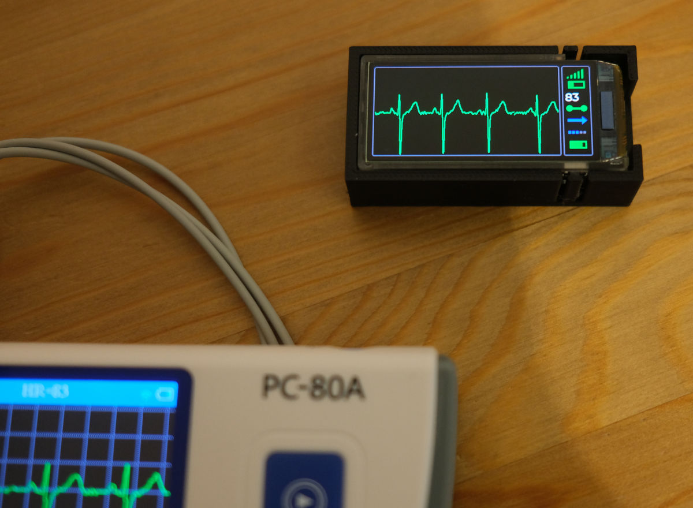

# Display (real or synthesised) ECG on ESP32S3 with AMOLED

This firmware can be flashed on:

* LilyGO T-Display-S3-AMOLED
* WaveShare ESP32-S3 1.91inch AMOLED

Both models are dev boards based on ESP32 SoC and featuring a 240x536
AMOLED display panel. As most Espressif SoCs, they support WiFi (2.4 MHz only)
and Bluetooth + Bluetooth LE.

This project is a from-scratch reimplementation of
[my other project](https://github.com/thewyrdguy/ECGDisplay)
that uses [ESP-IDF](https://docs.espressif.com/projects/esp-idf/en/)
instead of [Arduino](https://www.arduino.cc/).
I got unhappy about the way BLE support is implemented in Arduino, and decided
to try an alternative (more professional?) SDK.

I was lucky to find a fairly new (as of this writing) driver for the AMOLED
display chip that seems to work for me with ESP-IDF SDK.

# What does it do?

When you turn on the device, it runs BLE scan trying to find either an HRM
sensor (one of those chest strap fitness gadgets), or a Viatom ECG recorder
(one-lead ECG recorder marketed as "Heal Force" or "Prince" or some other
strange brand, that usually has "PC-80A" or "PC-80B" written on it).

Chest strap sensors do not provide ECG readings, but they do provide the
sequence of RR interval durations. In this case, this gadget generates a
simulated ECG that represens RR intervals received from the sensor.

PC-80B recorder provides real ECG reading, sampled at 150 Hz, as a stream
of BLE messages. In this case, we are able to display real ECG trace,
in near real time. Recorder has to be set to "wireless" mode via its
"Settings" menu.

# Building

* Install ESP-IDF (refer to the documentaiton, link above).
* Clone this repository
* Follow IDF instructions for building a project (`idf.py set-target esp32s3`,
  `idf.py build`, `idf.py -p <tty-where-the-module-is-connected> flash`).
* Have a running PC-80B or HRM in the vicinity. You should see ECG trace
  running on the display in a few seconds.

# Physical design

There is an openscad design for a 3d printed case for the Lilygo version
of the board (T-Display-AMOLED v2.0) with 320 mAh lithium polymer battery.
Adjust dimentions if you use a different version of the board or
a different battery.

# Hardware notes

- Waveshare module has reversed button positions compared to Lilygo module.
- Waveshare module does not have GPIO4 connected to the battery voltage
  divider, it is impossible(?) to get battery voltage reading. Battery
  charge indicator will show nonsense.
- Waveshare and Lilygo have slightly different geometry; provided box
  design is for Lilygo. It has to be adjusted to fit Waveshare.
